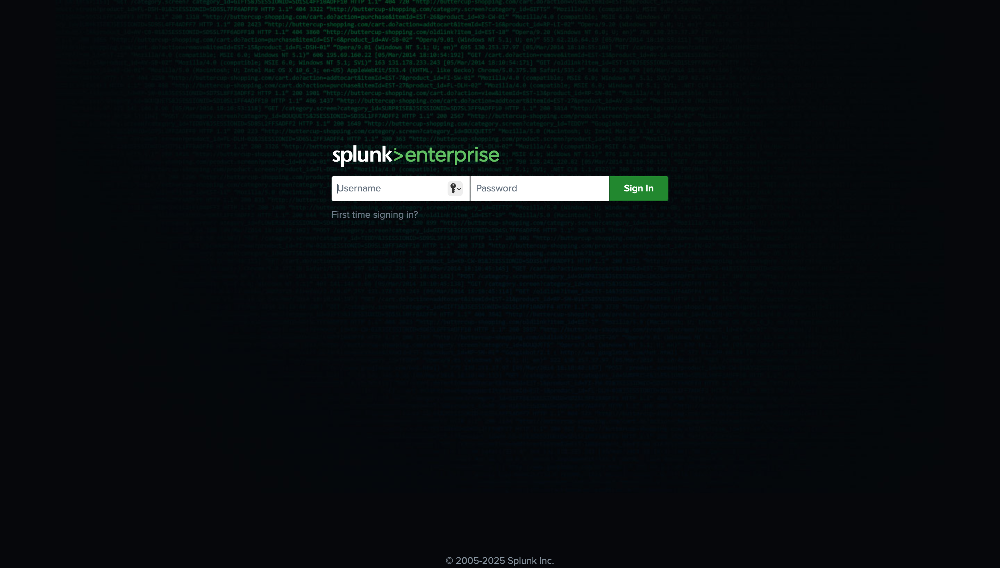
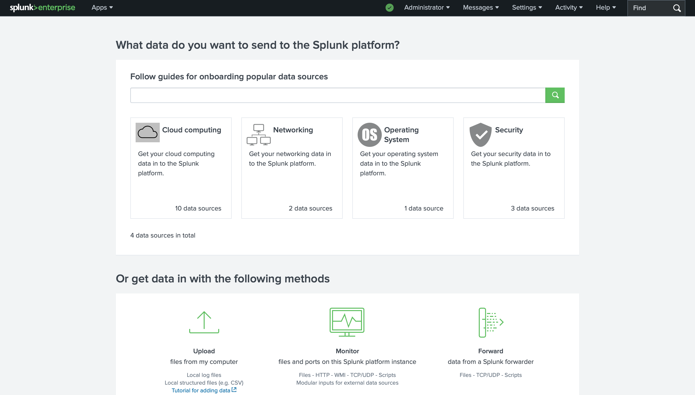
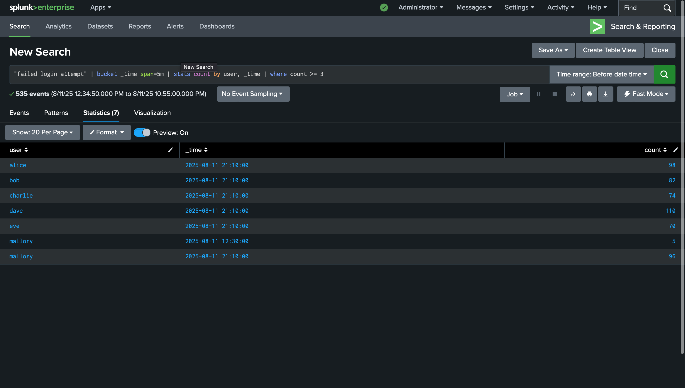
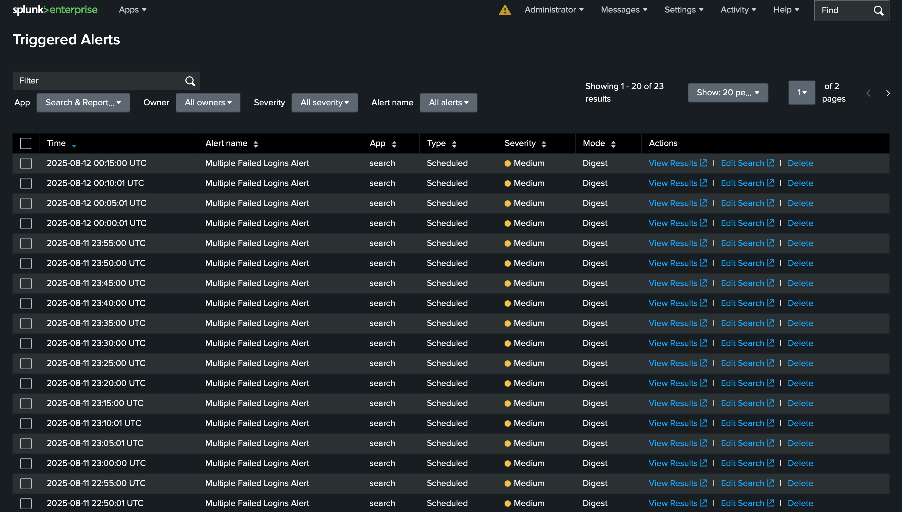

## Setup

1. Install Splunk Enterprise in a VM or local environment.
2. Add data inputs to ingest logs from `logs/` folder.
3. Run the Python scripts to generate log events.

## Screenshots

### Splunk Login

### Add Data

### Search Query Execution

### Triggered Alert

### Investigation Dashboard

## Conclusion

This project demonstrates the end-to-end process of setting up a SIEM solution with Splunk, from ingesting logs to investigating alerts. It can be extended with more complex log generation, correlation searches, and automated responses.

---
